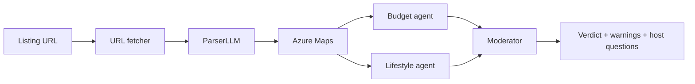

# wg-housing-agent
I built this project after a familiar frustration while searching for flatshares as a student in Germany: after using the usual listing filters, I'd still be left guessing whether a room was worth pursuing once budget, commute, furnishing needs, and the social vibe of the WG all had to be weighed together for my situation.

## What it does

1. Fetches and cleans the HTML of a WG-Gesucht listing
2. Extracts structured data via Azure OpenAI (with a rule-based regex fallback)
3. Enriches it with Azure Maps: geocoding, commute estimate to a fixed destination, nearby parks / pools / supermarkets
4. Runs two specialist LLM agents (budget/value and lifestyle fit), each with its own deterministic fallback
5. A moderator agent synthesises a verdict, surfaces warnings, and proposes follow-up questions for the host



## Tech stack

- **Python 3.12** — FastAPI, Pydantic v2, LangGraph
- **LLM** — Azure OpenAI (GPT-4o-mini), JSON-mode structured outputs
- **Location** — Azure Maps (Search, Routing, POI category search)
- **Frontend** — Streamlit, calling FastAPI over HTTP
- **Infra** — Docker, Azure Container Apps, Azure Container Registry
- **CI/CD** — GitHub Actions with OIDC federated auth to Azure (no long-lived secrets)

## Running locally

Copy `.env.example` to `.env` and fill in your credentials:

```
AZURE_OPENAI_ENDPOINT=...
AZURE_OPENAI_API_KEY=...
AZURE_OPENAI_DEPLOYMENT=...
AZURE_MAPS_SUBSCRIPTION_KEY=...
```

Then open two terminals:

**Terminal 1 — API server**
```bash
uvicorn app.main:app --reload
```

**Terminal 2 — Streamlit UI**
```bash
streamlit run streamlit_app.py
```

The UI connects to the API at `http://localhost:8000` by default. Set `BACKEND_URL` in your environment to point elsewhere (e.g. a remote or Docker-networked instance).

## Plans
- [ ] Automated listing intake: either scheduled web-search by profile, or parsing marketplaces' filter-match email notifications, so the agent evaluates new listings as they appear
- [ ] Historical evaluation log so a user can compare listings over time
